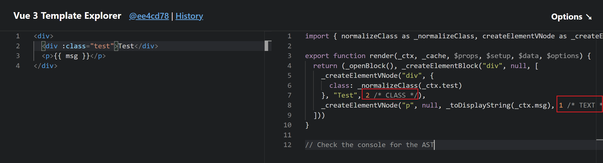

# 【源码阅读】@vue/shared —— Vue3 内部工具函数库

## 前言

[@vue/shared](https://www.npmjs.com/package/@vue/shared) 是 Vue3 内部工具函数库，其源码位于 [Vue3 仓库](https://github.com/vuejs/core) 的 `packages/shared` 目录下，同时作为 Vue3 的一个单独的 NPM 包发布，其版本号与 Vue3 保持一致。

> 注意：本文基于 `@vue/shared` 版本 `v3.3.4` 进行分析的。

## 目录结构

```
├─index.js // commonjs 入口文件
├─LICENSE
├─package.json
├─README.md
├─__tests__ // 单元测试目录
|     ├─codeframe.spec.ts
|     ├─escapeHtml.spec.ts
|     ├─looseEqual.spec.ts
|     ├─normalizeProp.spec.ts
|     ├─toDisplayString.spec.ts
├─src
|  ├─codeframe.ts
|  ├─domAttrConfig.ts
|  ├─domTagConfig.ts
|  ├─escapeHtml.ts
|  ├─general.ts
|  ├─globalsAllowList.ts
|  ├─index.ts
|  ├─looseEqual.ts
|  ├─makeMap.ts
|  ├─normalizeProp.ts
|  ├─patchFlags.ts
|  ├─shapeFlags.ts
|  ├─slotFlags.ts
|  ├─toDisplayString.ts
|  └typeUtils.ts
├─dist 打包输出目录
|  ├─shared.cjs.js // commonjs 开发环境版本
|  ├─shared.cjs.prod.js // commonjs 生产环境版本
|  ├─shared.d.ts // TS 类型声明
|  └shared.esm-bundler.js // ESM 规范的入口文件
```

接下来，我们逐个文件进行介绍。

## package.json 

```json
{
  ...
  "main": "index.js",
  "module": "dist/shared.esm-bundler.js",
  "types": "dist/shared.d.ts"
  ...
}
```

其中 `main` 字段指定了 `commonjs` 规范的入口文件，`module` 字段指定了 ESM 规范的入口文件，`types` 字段指定了 TS 类型声明的入口文件。

## index.js

内容很简单，就是根据当前环境加载对应的模块。

```js
'use strict'
if (process.env.NODE_ENV === 'production') {
  module.exports = require('./dist/shared.cjs.prod.js')
} else {
  module.exports = require('./dist/shared.cjs.js')
}
```

在 `commonjs` 环境下使用:

```js
const vueUtils = require('@vue/shared')

// ... 
```

## src 源代码目录

### index.ts

其作用就是将其他文件导出，作为打包的入口文件。

```ts
export { makeMap } from './makeMap'
export * from './general'
export * from './patchFlags'
export * from './shapeFlags'
export * from './slotFlags'
export * from './globalsAllowList'
export * from './codeframe'
export * from './normalizeProp'
export * from './domTagConfig'
export * from './domAttrConfig'
export * from './escapeHtml'
export * from './looseEqual'
export * from './toDisplayString'
export * from './typeUtils'
```

### makeMap.ts

`makeMap(str: string, expectsLowerCase?: boolean)`:

- `str` 是一个以逗号分隔的字符串，用于生成一个 map 字典
- `expectsLowerCase` 是一个布尔值，表示是否需要将字符串转换为小写

返回值:

- 一个匿名函数，该函数接收一个字符串作为参数，并返回一个布尔值，表示该字符串是否在给定的 map 中

> 这是一个典型的**函数柯里化**的应用，通过一个闭包将 `map` 保存在匿名函数的上下文中，这意味着 `map` 已经被缓存，并且可以在后续的调用中复用，这也是函数柯里化的一个特点。

```ts
/**
 * Make a map and return a function for checking if a key
 * is in that map.
 * IMPORTANT: all calls of this function must be prefixed with
 * \/\*#\_\_PURE\_\_\*\/
 * So that rollup can tree-shake them if necessary.
 */
export function makeMap(
  str: string,
  expectsLowerCase?: boolean
): (key: string) => boolean {
  const map: Record<string, boolean> = Object.create(null)
  const list: Array<string> = str.split(',')
  for (let i = 0; i < list.length; i++) {
    map[list[i]] = true
  }
  return expectsLowerCase ? val => !!map[val.toLowerCase()] : val => !!map[val]
}
```

`makeMap` 函数在 Vue3 中有非常多的使用。

#### 例子1: 识别模板中的 JS 全局函数

```ts
// packages/shared/src/globalsAllowList.ts
const GLOBALS_ALLOWED =
  'Infinity,undefined,NaN,isFinite,isNaN,parseFloat,parseInt,decodeURI,' +
  'decodeURIComponent,encodeURI,encodeURIComponent,Math,Number,Date,Array,' +
  'Object,Boolean,String,RegExp,Map,Set,JSON,Intl,BigInt,console'

export const isGloballyAllowed = /*#__PURE__*/ makeMap(GLOBALS_ALLOWED)

/** @deprecated use `isGloballyAllowed` instead */
export const isGloballyWhitelisted = isGloballyAllowed
```

`GLOBALS_ALLOWED` 常量定义了允许在模板中使用(插值表达式，指令)的的全局变量，`makeMap` 函数接收这个常量作为参数，然后返回一个函数 `isGloballyAllowed`，以后只要使用这个函数，传入一个变量名，就可以判断这个变量名是否在 `GLOBALS_ALLOWED` 中。

#### 例子2: 区分组件和html原生标签

下面代码中的 `isHTMLTag()` 函数会在模板解析时用来判断解析到的标签是否是一个 html 标签，如果不是，则很可能是一个用户自定义的**组件**。

```ts
// packages/shared/src/domTagConfig.ts

// These tag configs are shared between compiler-dom and runtime-dom, so they
// must be extracted in shared to avoid creating a dependency between the two.
import { makeMap } from './makeMap'

// https://developer.mozilla.org/en-US/docs/Web/HTML/Element
const HTML_TAGS =
  'html,body,base,head,link,meta,style,title,address,article,aside,footer,' +
  'header,hgroup,h1,h2,h3,h4,h5,h6,nav,section,div,dd,dl,dt,figcaption,' +
  'figure,picture,hr,img,li,main,ol,p,pre,ul,a,b,abbr,bdi,bdo,br,cite,code,' +
  'data,dfn,em,i,kbd,mark,q,rp,rt,ruby,s,samp,small,span,strong,sub,sup,' +
  'time,u,var,wbr,area,audio,map,track,video,embed,object,param,source,' +
  'canvas,script,noscript,del,ins,caption,col,colgroup,table,thead,tbody,td,' +
  'th,tr,button,datalist,fieldset,form,input,label,legend,meter,optgroup,' +
  'option,output,progress,select,textarea,details,dialog,menu,' +
  'summary,template,blockquote,iframe,tfoot'

/**
 * Compiler only.
 * Do NOT use in runtime code paths unless behind `__DEV__` flag.
 */
export const isHTMLTag = /*#__PURE__*/ makeMap(HTML_TAGS)

// ... 省略其他代码
```

### general.ts

`packages/shared/src/general.ts`

这个文件中包含了一些通用的工具函数。

> 由于有些工具函数比较简单，所以只会介绍一些个人觉得常用的。


#### 数据类型判断

在 ES6 中，我们判断一个值是否是数组，使用的是 `Array.isArray()`，但在 ES5 中，我们需要使用`Object.prototype.toString.call()`。

写一个兼容 ES5 和 ES6 的判断是否是数组的方法：

```ts
if (!Array.isArray) { 
  // 如果没有 Array.isArray 方法
  // 则使用 Object.prototype.toString.call() 来判断
  Array.isArray = function(arg: any) {
    return Object.prototype.toString.call(arg) === '[object Array]'
  }
}
```

同理，还可以使用 `Object.prototype.toString.call()` 来判断是否是一个 `Number / String / Boolean / Set / Map / Date` 等。

```ts
Object.prototype.toString.call(1) // '[object Number]'
Object.prototype.toString.call('a') // '[object String]'
Object.prototype.toString.call(true) // '[object Boolean]'
Object.prototype.toString.call(new Set()) // '[object Set]'
Object.prototype.toString.call(new Map()) // '[object Map]'
Object.prototype.toString.call(new Date()) // '[object Date]'
```

封装一些通用的判断值类型的工具函数:

```ts
const objectToString = Object.prototype.toString
const toTypeString = (value: unknown): string => objectToString.call(value)

export const isArray = Array.isArray || ((value: unknown): value is any[] => toTypeString(value) === '[object Array]') // 兼容 ES5 和 ES6 的判断是否是数组的方法
export const isMap = (val: unknown): val is Map<any, any> => toTypeString(val) === '[object Map]'
export const isSet = (val: unknown): val is Set<any> => toTypeString(val) === '[object Set]'
export const isDate = (val: unknown): val is Date => toTypeString(val) === '[object Date]'
export const isRegExp = (val: unknown): val is RegExp => toTypeString(val) === '[object RegExp]'
export const isFunction = (val: unknown): val is Function => typeof val === 'function'
export const isString = (val: unknown): val is string => typeof val === 'string'
export const isSymbol = (val: unknown): val is symbol => typeof val === 'symbol'
export const isObject = (val: unknown): val is Record<any, any> => val !== null && typeof val === 'object'
export const isPlainObject = (val: unknown): val is object => toTypeString(val) === '[object Object]'

export const isPromise = <T = any>(val: unknown): val is Promise<T> => {
  return (
    (isObject(val) || isFunction(val)) &&
    isFunction((val as any).then) &&
    isFunction((val as any).catch)
  )
}
```

#### isOn

判断是否是事件名。

```ts
const onRE = /^on[^a-z]/
export const isOn = (key: string) => onRE.test(key)
```

#### remove

移除数组中的某个元素。

```ts
export const remove = <T>(arr: T[], el: T) => {
  const i = arr.indexOf(el)
  if (i > -1) {
    arr.splice(i, 1)
  }
}
```

#### hasOwn

判断对象是否包含某个属性。

```ts
const hasOwnProperty = Object.prototype.hasOwnProperty
export const hasOwn = (
  val: object,
  key: string | symbol
): key is keyof typeof val => hasOwnProperty.call(val, key)
```

#### toRawType

获取原始类型。

比如:

```ts
toRawType(1) // 'Number'
```

```ts
export const toRawType = (value: unknown): string => {
  // extract "RawType" from strings like "[object RawType]"
  return toTypeString(value).slice(8, -1)
}
```

#### isReservedProp

判断是否是保留属性。

```ts
export const isReservedProp = /*#__PURE__*/ makeMap(
  // the leading comma is intentional so empty string "" is also included
  ',key,ref,ref_for,ref_key,' +
    'onVnodeBeforeMount,onVnodeMounted,' +
    'onVnodeBeforeUpdate,onVnodeUpdated,' +
    'onVnodeBeforeUnmount,onVnodeUnmounted'
)
```

#### isBuiltInDirective

判断是否是内置指令。

```ts
export const isBuiltInDirective = /*#__PURE__*/ makeMap(
  'bind,cloak,else-if,else,for,html,if,model,on,once,pre,show,slot,text,memo'
)
```

#### cacheStringFunction

缓存字符串函数。

> 和上面提到的 `makeMap()` 一样，都是函数柯里化的应用。

```ts
const cacheStringFunction = <T extends (str: string) => string>(fn: T): T => {
  const cache: Record<string, string> = Object.create(null)
  return ((str: string) => {
    const hit = cache[str]
    return hit || (cache[str] = fn(str))
  }) as T
}
```

#### def

给对象定义不可枚举的属性。

```ts
export const def = (obj: object, key: string | symbol, value: any) => {
  Object.defineProperty(obj, key, {
    configurable: true,
    enumerable: false,
    value
  })
}
```

#### globalThis

[globalThis 介绍](https://developer.mozilla.org/zh-CN/docs/Web/JavaScript/Reference/Global_Objects/globalThis)

> 全局属性 globalThis 提供了一个标准的方式来获取不同环境下的全局 this 对象，类似于全局对象（global object）。

在以前，JavaScript 没有标准的方式访问全局环境，比如浏览器、Node.js 或者 Web Worker。

在浏览器环境，可以使用 `window`；在 Node.js 环境中，可以使用 `global`；在 Web Worker 环境中，只能使用 `self`。

```ts
// 用于缓存 全局 this 对象
let _globalThis: any
export const getGlobalThis = (): any => {
  // 优先使用 globalThis，如果不存在则做兼容性判断
  return (
    _globalThis ||
    (_globalThis =
      typeof globalThis !== 'undefined'
        ? globalThis
        : typeof self !== 'undefined'
        ? self
        : typeof window !== 'undefined'
        ? window
        : typeof global !== 'undefined'
        ? global
        : {})
  )
}
```

### patchFlags.ts

`patchFlag` 会在编译的过程中生成的，用于标记 diff 的方式，不同的 `patchFlag` 代表不同的 diff 策略。

当组件更新时，diff 算法会根据 `patchFlag` 来减少计算量，实现靶向更新。



```ts
// packages/shared/src/patchFlags.ts

export const enum PatchFlags {
  TEXT = 1,
  CLASS = 1 << 1,
  STYLE = 1 << 2,
  PROPS = 1 << 3,
  FULL_PROPS = 1 << 4,
  HYDRATE_EVENTS = 1 << 5,
  STABLE_FRAGMENT = 1 << 6,
  KEYED_FRAGMENT = 1 << 7,
  UNKEYED_FRAGMENT = 1 << 8,
  NEED_PATCH = 1 << 9,
  DYNAMIC_SLOTS = 1 << 10,
  DEV_ROOT_FRAGMENT = 1 << 11,
  HOISTED = -1,
  BAIL = -2
}

/**
 * dev only flag -> name mapping
 */
export const PatchFlagNames: Record<PatchFlags, string> = {
  [PatchFlags.TEXT]: `TEXT`,
  [PatchFlags.CLASS]: `CLASS`,
  [PatchFlags.STYLE]: `STYLE`,
  [PatchFlags.PROPS]: `PROPS`,
  [PatchFlags.FULL_PROPS]: `FULL_PROPS`,
  [PatchFlags.HYDRATE_EVENTS]: `HYDRATE_EVENTS`,
  [PatchFlags.STABLE_FRAGMENT]: `STABLE_FRAGMENT`,
  [PatchFlags.KEYED_FRAGMENT]: `KEYED_FRAGMENT`,
  [PatchFlags.UNKEYED_FRAGMENT]: `UNKEYED_FRAGMENT`,
  [PatchFlags.NEED_PATCH]: `NEED_PATCH`,
  [PatchFlags.DYNAMIC_SLOTS]: `DYNAMIC_SLOTS`,
  [PatchFlags.DEV_ROOT_FRAGMENT]: `DEV_ROOT_FRAGMENT`,
  [PatchFlags.HOISTED]: `HOISTED`,
  [PatchFlags.BAIL]: `BAIL`
}
```

### shapeFlags.ts

用于标记虚拟DOM的类型。

```ts
export const enum ShapeFlags {
  ELEMENT = 1,
  FUNCTIONAL_COMPONENT = 1 << 1,
  STATEFUL_COMPONENT = 1 << 2,
  TEXT_CHILDREN = 1 << 3,
  ARRAY_CHILDREN = 1 << 4,
  SLOTS_CHILDREN = 1 << 5,
  TELEPORT = 1 << 6,
  SUSPENSE = 1 << 7,
  COMPONENT_SHOULD_KEEP_ALIVE = 1 << 8,
  COMPONENT_KEPT_ALIVE = 1 << 9,
  COMPONENT = ShapeFlags.STATEFUL_COMPONENT | ShapeFlags.FUNCTIONAL_COMPONENT
}
```

### slotFlags.ts

> 看源码注释，目前只知道大概和 slot 的更新有关，不清楚具体的细节，以后知道了再补上。

```ts
// packages/shared/src/slotFlags.ts

export const enum SlotFlags {
  STABLE = 1,
  DYNAMIC = 2,
  FORWARDED = 3
}

/**
 * Dev only
 */
export const slotFlagsText = {
  [SlotFlags.STABLE]: 'STABLE',
  [SlotFlags.DYNAMIC]: 'DYNAMIC',
  [SlotFlags.FORWARDED]: 'FORWARDED'
}

```

### codeframe.ts

目前暂不清楚具体用途，以后知道了再补上。

### normalizeProp.ts

用于规范化 `prop`，包括 `css`, `style` 和 `props`。

### globalsAllowList.ts & domTagConfig.ts & domAttrConfig.ts

这几个文件在前面介绍 `makeMap()` 时，已经了解过了，大致就是利用 `makeMap()` 函数柯里化的特点，就不赘述了。

### escapeHtml.ts

先看看 `escapeHtml()` 的测试用例:

```ts
test('escapeHTML', () => {
  expect(escapeHtml(`foo`)).toBe(`foo`)
  expect(escapeHtml(true)).toBe(`true`)
  expect(escapeHtml(false)).toBe(`false`)
  expect(escapeHtml(`a && b`)).toBe(`a &amp;&amp; b`)
  expect(escapeHtml(`"foo"`)).toBe(`&quot;foo&quot;`)
  expect(escapeHtml(`'bar'`)).toBe(`&#39;bar&#39;`)
  expect(escapeHtml(`<div>`)).toBe(`&lt;div&gt;`)
})
```

可以知道，`escapeHtml()` 函数的作用就是对 html 字符串进行转义。

```ts
// packages/shared/src/escapeHtml.ts

const escapeRE = /["'&<>]/
export function escapeHtml(string: unknown) {
  const str = '' + string
  const match = escapeRE.exec(str)

  if (!match) {
    return str
  }
  let html = ''
  let escaped: string
  let index: number
  let lastIndex = 0
  for (index = match.index; index < str.length; index++) {
    switch (str.charCodeAt(index)) {
      case 34: // "
        escaped = '&quot;'
        break
      case 38: // &
        escaped = '&amp;'
        break
      case 39: // '
        escaped = '&#39;'
        break
      case 60: // <
        escaped = '&lt;'
        break
      case 62: // >
        escaped = '&gt;'
        break
      default:
        continue
    }
    if (lastIndex !== index) {
      html += str.slice(lastIndex, index)
    }
    lastIndex = index + 1
    html += escaped
  }
  return lastIndex !== index ? html + str.slice(lastIndex, index) : html
}

// https://www.w3.org/TR/html52/syntax.html#comments
const commentStripRE = /^-?>|<!--|-->|--!>|<!-$/g

// 转义 html 注释
export function escapeHtmlComment(src: string): string {
  return src.replace(commentStripRE, '')
}
```

### looseEqual.ts

用于比较两个值是否相等 (loose 宽松比较)。

> 关于 `looseEqual()` 的用法可以查看单元测试，位置在: `packages/shared/__tests__/looseEqual.spec.ts`。

从测试用例中取出几个例子，发现对于 `1` 和 `'1'`，`true` 和 `'true'`，`looseEqual` 认为它们相等。

```js
const number = 1
expect(looseEqual(String(number), number)).toBe(true)

const bool = true
expect(looseEqual(String(bool), bool)).toBe(true)
```

> 查看vue3源码，发现 `looseEqual()` 在 `v-model` 指令的实现中有用到，位置: `packages/runtime-core/src/directives/vModel.ts`

`looseEqual()` 的实现如下:

```ts
// packages/shared/src/looseEqual.ts 

// 松散比较两个数组是否相等
function looseCompareArrays(a: any[], b: any[]) {
  // 如果长度不等
  if (a.length !== b.length) return false
  let equal = true
  for (let i = 0; equal && i < a.length; i++) {
    equal = looseEqual(a[i], b[i])
  }
  return equal
}

// 松散比较两个值是否相等
export function looseEqual(a: any, b: any): boolean {
  // 如果两个值或引用相等
  if (a === b) return true
  let aValidType = isDate(a)
  let bValidType = isDate(b)
  // 验证日期类型，精确到毫秒
  if (aValidType || bValidType) {
    return aValidType && bValidType ? a.getTime() === b.getTime() : false
  }
  aValidType = isSymbol(a)
  bValidType = isSymbol(b)
  // 验证 symbol 类型
  if (aValidType || bValidType) {
    return a === b
  }
  aValidType = isArray(a)
  bValidType = isArray(b)
  // 验证数组类型
  if (aValidType || bValidType) {
    return aValidType && bValidType ? looseCompareArrays(a, b) : false
  }
  aValidType = isObject(a)
  bValidType = isObject(b)
  // 验证对象类型
  if (aValidType || bValidType) {
    /* istanbul ignore if: this if will probably never be called */
    if (!aValidType || !bValidType) {
      return false
    }
    const aKeysCount = Object.keys(a).length
    const bKeysCount = Object.keys(b).length
    // 比较键的数量
    if (aKeysCount !== bKeysCount) {
      return false
    }
    for (const key in a) {
      const aHasKey = a.hasOwnProperty(key)
      const bHasKey = b.hasOwnProperty(key)
      if (
        (aHasKey && !bHasKey) ||
        (!aHasKey && bHasKey) ||
        !looseEqual(a[key], b[key]) // 递归
      ) {
        return false
      }
    }
  }
  // 最后强制类型转换为字符串，再做比较
  return String(a) === String(b)
}

// 类似 Array.prototype.indexOf()
// 不过这里是松散比较
export function looseIndexOf(arr: any[], val: any): number {
  return arr.findIndex(item => looseEqual(item, val))
}
```

### toDisplayString.ts

`toDisplayString()` 用来将插值表达式转换为字符串。

比如下面的模板:

```html
<template>
  <div>{{ msg }}</div>
</template>
```

经过编译后，会得到下面的渲染函数:

```js
import { toDisplayString as _toDisplayString, createElementVNode as _createElementVNode, openBlock as _openBlock, createElementBlock as _createElementBlock } from "vue"

export function render(_ctx, _cache, $props, $setup, $data, $options) {
  return (_openBlock(), _createElementBlock("template", null, [
    _createElementVNode("div", null, _toDisplayString(_ctx.msg), 1 /* TEXT */)
  ]))
}
```

[Vue3 Template Explorer](https://template-explorer.vuejs.org/#eyJzcmMiOiI8dGVtcGxhdGU+XHJcbiAgPGRpdj57eyBtc2cgfX08L2Rpdj5cclxuPC90ZW1wbGF0ZT4iLCJvcHRpb25zIjp7Im9wdGltaXplSW1wb3J0cyI6ZmFsc2V9fQ==)

在上面的渲染函数中，`toDisplayString` 函数会将插值表达式 `_ctx.msg` 转换为字符串。


下面是 `toDisplayString()` 的源代码:

```ts
// packages/shared/src/toDisplayString.ts

/**
 * For converting {{ interpolation }} values to displayed strings.
 * @private
 */
export const toDisplayString = (val: unknown): string => {
  return isString(val)
    ? val
    : val == null
    ? ''
    : isArray(val) ||
      (isObject(val) &&
        (val.toString === objectToString || !isFunction(val.toString)))
    ? JSON.stringify(val, replacer, 2)
    : String(val)
}

const replacer = (_key: string, val: any): any => {
  // can't use isRef here since @vue/shared has no deps
  if (val && val.__v_isRef) {
    return replacer(_key, val.value)
  } else if (isMap(val)) {
    return {
      [`Map(${val.size})`]: [...val.entries()].reduce((entries, [key, val]) => {
        ;(entries as any)[`${key} =>`] = val
        return entries
      }, {})
    }
  } else if (isSet(val)) {
    return {
      [`Set(${val.size})`]: [...val.values()]
    }
  } else if (isObject(val) && !isArray(val) && !isPlainObject(val)) {
    return String(val)
  }
  return val
}
```

如果传递给 `toDisplayString()` 的值是数组或对象，则会使用 `JSON.stringify()` 来处理。

[JSON.stringify(value[, replacer [, space]])](https://developer.mozilla.org/zh-CN/docs/Web/JavaScript/Reference/Global_Objects/JSON/stringify)

> 如果 `replacer` 参数是一个函数，则在序列化过程中，被序列化的值的每个属性都会经过该函数的转换和处理。

### typeUtils.ts

`TS` 类型工具函数。

TS 水平还是太菜了，体操玩不转，不太看的懂，以后再补。

## 总结

首先说学到了什么:

- 对于工具函数库，首先看单元测试，就可以知道它的基本用法，然后再去源码中搜索它在哪里使用了，大概做了什么工作
- `makeMap()` 函数柯里化这种用法值得借鉴
- 了解了 `globalThis` 提供了一种标准的方式获取不同环境下的 全局 `this` 对象
- 加深了对 Vue3 源码中工具函数的了解

不足:

- 单元测试虽然能看懂，但是却很少写，这块可以学习下
- TS 类型体操太菜，待学习
