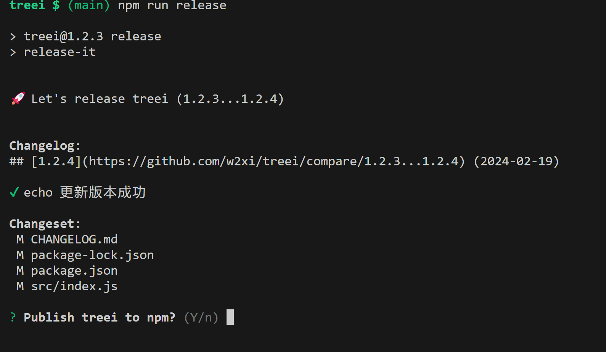

# 【造轮子 | treei】一个用于输出目录树形结构的命令行工具

## 前言

写博客的时候，可能经常要用到类似 linux 系统中的 tree 命令，用来在文章中展示目录的树形结构，比如下面这种形式:

```
├──.gitignore
├──.release-it.json
├──CHANGELOG.md
├──package-lock.json
├──package.json
├──README.md
└──src
|   └──index.js
```

但是，在 windows 系统中，并没有 tree 命令。

之前也用过 [treer](https://www.npmjs.com/package/treer) 这个工具，总体来说蛮好用的，但是我想加点新的功能，比如:

- 支持将结果输出到文件时使用追加模式，而不是覆盖模式
- 支持用 emoji 区分文件和文件夹

于是，本着学习的目的，我就造了一个轮子 [treei](https://www.npmjs.com/package/treei)。


## 目录结构

[treei](https://github.com/w2xi/treei) 项目的目录结构:

```
D:\www\github\wheels\treei
├──📄.editorconfig
├──📄.eslintrc.js
├──📄.gitignore
├──📄.prettierrc.js
├──📄.release-it.json
├──📄CHANGELOG.md
├──📄LICENSE
├──📄package-lock.json
├──📄package.json
├──📄README.md
└──📁src
|   ├──📄config.js
|   ├──📄generate.js
|   ├──📄index.js
|   ├──📄toTree.js
|   └──📄utils.js
```

## 实现

### 准备工作

用到的依赖:

- `fs`: Node.js 内置模块，提供了文件操作相关的功能
- `commander`: Node.js 命令行界面的完整解决方案
- `release-it`: 用于管理 npm 包的版本和发布等工作

### 命令行参数解析

```js
const { program } = require('commander')
const package = require('../package.json')

program
  .name('treei')
  // 包版本
  .version(package.version)
  .description('Generate a directory structure tree')
  .option('-i, --ignore <ig>', 'ignore specific directory name, separated by comma or \'|\'')
  .option('-l, --layer <layer>', 'specify the layer of output')
  // 如果不传 -d 参数，则默认指定 process.cwd() 为脚本执行的目录
  .option('-d, --directory <dir>', 'specify the directory to generate structure tree', process.cwd())
  .option('-f, --only-folder', 'output folder only')
  .option('--icon', 'output emoji icon, prefixing filename or directory')
  .option('-o, --output <output>', 'export content into a file, appending mode by default')
  // 解析参数
  .parse(process.argv)
```

上面的代码以链式的方式执行，最后使用 `.parse(process.argv)` 解析所有传入的参数。

### 处理参数选项

```js
const fs = require('fs')

// 拿到所有解析后的参数
let options = program.opts()
// 保存退出方法，最后执行
const onExits = []

function handleOptions() {
  // 处理 `-i` 参数
  if (options.ignore) {
    options.ignore = options.ignore.replace(/\s*/g, '').split(/,|\|/)
  }
  // 处理 `-l` 参数
  if (options.layer && !Number.isNaN(parseInt(options.layer))) {
    options.layer = parseInt(options.layer)
  }
  // 处理 `-o` 参数
  if (options.output) {
    onExits.push((result) => {
      let outputString = result
      if (fileExistSync(options.output)) { // 文件存在，则在末尾追加内容
        outputString = '\n' + result
      }
      fs.appendFile(options.output, outputString, (err) => {
        if (err) throw err
      })
    })
  }
}

// 检查文件或目录是否存在
function fileExistSync(path) {
  try {
    fs.accessSync(path, fs.constants.F_OK)
    return true
  } catch(e) {
    return false
  }
}
```

### toTree

这里用到了 `BFS`(广度优先搜索) 来遍历目录。

> 其实最开始使用的是 `DFS`(深度优先搜索)，但是在配合使用 `-l` (输出层级) 参数时，发现层级过深时，会存在性能问题。因为 `DFS` 会递归到嵌套目录的最底层才开始处理整个目录结构，如果指定参数 `-l 1`，显然使用 `DFS` 会造成无谓的性能浪费且嵌套层级越深，处理的时间越长，所以最后改成了广度优先搜索。

**约定节点类型**:

根节点:
```js
{
  type: 'root'
}
```

文件节点:
```js
{
  type: 'file'
}
```

目录节点:

```js
{
  type: 'directory'
}
```

下面的代码会将目录树转成 `json` 数据结构:

```js
function toTree(options = {}) {
  const { directory } = options
  return bfs(directory, options)
}

function bfs(path, options = {}) {
  let deep = 0
  const { ignore, onlyFolder, layer } = options
  const root = {
    path,
    name: path,
    type: 'root',
    children: [],
  }
  const queue = [root]

  while (queue.length) {
    const node = queue.shift()
    const { path, children } = node
    const dir = fs.readdirSync(path)

    if (layer && deep >= layer) break

    deep++

    for (let i = 0; i < dir.length; i++) {
      const item = dir[i]
      if (ignore && ignore.includes(item)) continue
      const childPath = `${path}/${item}`
      const isDir = isDirectory(childPath)
      if (onlyFolder && !isDir) continue

      const childItem = {
        path: childPath,
        name: item,
        type: isDir ? 'directory' : 'file',
      }
      if (isDir) {
        queue.push(childItem)
        childItem.children = []
      }
      children.push(childItem)
    }
  }
  return root
}

// 判断给定路径是否是目录
function isDirectory(path) {
  const stats = fs.lstatSync(path)
  return stats.isDirectory()
}
```

比如存在下面的目录结构:

```
├──📁treei
|   ├──📄.editorconfig
|   ├──📄.eslintrc.js
|   ├──📄.gitignore
|   ├──📄.prettierrc.js
|   ├──📄.release-it.json
|   ├──📄CHANGELOG.md
|   ├──📄LICENSE
|   ├──📄package-lock.json
|   ├──📄package.json
|   ├──📄README.md
|   └──📁src
|   |   ├──📄config.js
|   |   ├──📄generate.js
|   |   ├──📄index.js
|   |   ├──📄toTree.js
|   |   └──📄utils.js
```

经过转换后，会被处理成下面这种 `json` 数据格式:

```json
{
  "path": "D:\\www\\github\\wheels\\treei",
  "name": "D:\\www\\github\\wheels\\treei",
  "type": "root",
  "children": [
    {
      "path": "D:\\www\\github\\wheels\\treei/.editorconfig",
      "name": ".editorconfig",
      "type": "file"
    },
    {
      "path": "D:\\www\\github\\wheels\\treei/.eslintrc.js",
      "name": ".eslintrc.js",
      "type": "file"
    },
    {
      "path": "D:\\www\\github\\wheels\\treei/.gitignore",
      "name": ".gitignore",
      "type": "file"
    },
    {
      "path": "D:\\www\\github\\wheels\\treei/.prettierrc.js",
      "name": ".prettierrc.js",
      "type": "file"
    },
    {
      "path": "D:\\www\\github\\wheels\\treei/.release-it.json",
      "name": ".release-it.json",
      "type": "file"
    },
    {
      "path": "D:\\www\\github\\wheels\\treei/CHANGELOG.md",
      "name": "CHANGELOG.md",
      "type": "file"
    },
    {
      "path": "D:\\www\\github\\wheels\\treei/LICENSE",
      "name": "LICENSE",
      "type": "file"
    },
    {
      "path": "D:\\www\\github\\wheels\\treei/package-lock.json",
      "name": "package-lock.json",
      "type": "file"
    },
    {
      "path": "D:\\www\\github\\wheels\\treei/package.json",
      "name": "package.json",
      "type": "file"
    },
    {
      "path": "D:\\www\\github\\wheels\\treei/README.md",
      "name": "README.md",
      "type": "file"
    },
    {
      "path": "D:\\www\\github\\wheels\\treei/src",
      "name": "src",
      "type": "directory",
      "children": [
        {
          "path": "D:\\www\\github\\wheels\\treei/src/config.js",
          "name": "config.js",
          "type": "file"
        },
        {
          "path": "D:\\www\\github\\wheels\\treei/src/generate.js",
          "name": "generate.js",
          "type": "file"
        },
        {
          "path": "D:\\www\\github\\wheels\\treei/src/index.js",
          "name": "index.js",
          "type": "file"
        },
        {
          "path": "D:\\www\\github\\wheels\\treei/src/toTree.js",
          "name": "toTree.js",
          "type": "file"
        },
        {
          "path": "D:\\www\\github\\wheels\\treei/src/utils.js",
          "name": "utils.js",
          "type": "file"
        }
      ]
    }
  ]
}
```

### 生成字符串

```js
const emoji = {
  directory: '📁',
  file: '📄',
}
const characters = {
	border: '|',
	contain: '├',
	line: '─',
	last: '└'
}

function generate(data, options = {}, deep = 0) {
  // 保存输出的字符串
  let output = ''

  data.forEach((item, index) => {
    const borderPrefix = (characters.border + ' '.repeat(3)).repeat(deep)
    let contentPrefix = index === data.length - 1 ? characters.last : characters.contain 
    contentPrefix += characters.line.repeat(2)
    const content = options.icon ? `${emoji[item.type]}${item.name}` : `${item.name}`

    let currentLineStr = `${borderPrefix}${contentPrefix}${content}`
    currentLineStr += '\n'
    output += currentLineStr
    
    if (item.children) {
      // 递归处理
      output += generate(item.children, options, deep + 1)
    }
  })

  return output
}
```

### 最后

处理 `-o` 参数，将结果输出到指定文件:

```js
onExits.forEach(onExit => onExit(result))
```

### 完整代码

```js
const fs = require('fs')
const { program } = require('commander')
const package = require('../package.json')

program
  .name('treei')
  // 包版本
  .version(package.version)
  .description('Generate a directory structure tree')
  .option('-i, --ignore <ig>', 'ignore specific directory name, separated by comma or \'|\'')
  .option('-l, --layer <layer>', 'specify the layer of output')
  // 如果不传 -d 参数，则默认指定 process.cwd() 为脚本执行的目录
  .option('-d, --directory <dir>', 'specify the directory to generate structure tree', process.cwd())
  .option('-f, --only-folder', 'output folder only')
  .option('--icon', 'output emoji icon, prefixing filename or directory')
  .option('-o, --output <output>', 'export content into a file, appending mode by default')
  // 解析参数
  .parse(process.argv)

  // 拿到所有解析后的参数
let options = program.opts()
// 保存退出方法，最后执行
const onExits = []

function handleOptions() {
  // 处理 `-i` 参数
  if (options.ignore) {
    options.ignore = options.ignore.replace(/\s*/g, '').split(/,|\|/)
  }
  // 处理 `-l` 参数
  if (options.layer && !Number.isNaN(parseInt(options.layer))) {
    options.layer = parseInt(options.layer)
  }
  // 处理 `-o` 参数
  if (options.output) {
    onExits.push((result) => {
      let outputString = result
      if (fileExistSync(options.output)) { // 文件存在，则在末尾追加内容
        outputString = '\n' + result
      }
      fs.appendFile(options.output, outputString, (err) => {
        if (err) throw err
      })
    })
  }
}

// 检查文件或目录是否存在
function fileExistSync(path) {
  try {
    fs.accessSync(path, fs.constants.F_OK)
    return true
  } catch(e) {
    return false
  }
}

function toTree(options = {}) {
  const { directory } = options
  return bfs(directory, options)
}

function bfs(path, options = {}) {
  let deep = 0
  const { ignore, onlyFolder, layer } = options
  const root = {
    path,
    name: path,
    type: 'root',
    children: [],
  }
  const queue = [root]

  while (queue.length) {
    const node = queue.shift()
    const { path, children } = node
    const dir = fs.readdirSync(path)

    if (layer && deep >= layer) break

    deep++

    for (let i = 0; i < dir.length; i++) {
      const item = dir[i]
      if (ignore && ignore.includes(item)) continue
      const childPath = `${path}/${item}`
      const isDir = isDirectory(childPath)
      if (onlyFolder && !isDir) continue

      const childItem = {
        path: childPath,
        name: item,
        type: isDir ? 'directory' : 'file',
      }
      if (isDir) {
        queue.push(childItem)
        childItem.children = []
      }
      children.push(childItem)
    }
  }
  return root
}

// 判断给定路径是否是目录
function isDirectory(path) {
  const stats = fs.lstatSync(path)
  return stats.isDirectory()
}

const emoji = {
  directory: '📁',
  file: '📄',
}
const characters = {
	border: '|',
	contain: '├',
	line: '─',
	last: '└'
}

function generate(data, options = {}, deep = 0) {
  // 保存输出的字符串
  let output = ''

  data.forEach((item, index) => {
    const borderPrefix = (characters.border + ' '.repeat(3)).repeat(deep)
    let contentPrefix = index === data.length - 1 ? characters.last : characters.contain 
    contentPrefix += characters.line.repeat(2)
    const content = options.icon ? `${emoji[item.type]}${item.name}` : `${item.name}`

    let currentLineStr = `${borderPrefix}${contentPrefix}${content}`
    currentLineStr += '\n'
    output += currentLineStr
    
    if (item.children) {
      // 递归处理
      output += generate(item.children, options, deep + 1)
    }
  })

  return output
}

handleOptions()

const root = toTree(options)
const result = generate(root.children, options)

onExits.forEach(onExit => onExit(result))

// 终端打印结果
console.log(root.name)
console.log(result)
```

## 调试

现在我们已经完成了所有功能的开发，接下来就是进行调试了。

但总不能将包发布到 `npm` 后再下载下来进行调试吧？

因此，可以使用 `npm link` 命令，将将本地开发中的包链接到全局环境中，这样我们就可以直接在项目中使用这个包了。

在项目根目录下执行:

```bash
npm link
```

查看全局安装包:

```bash
$ npm ls  -g
D:\software\nvm\nodejs -> .\
├── @antfu/ni@0.21.12
├── http-server@14.1.1
├── npm@9.6.7
├── nrm@1.2.6
├── pnpm@8.6.12
├── treei@1.2.3 -> .\..\..\..\www\github\wheels\treei
├── typescript@5.3.3
```

> `npm link` 主要做了两件事：
  > 1. 为目标 npm 模块创建软链接，将其链接到全局 node 模块安装路径 D:\software\nvm\nodejs\node_modules。
  > 2. 为目标 npm 模块的可执行 bin 文件创建软链接，将其链接到全局node命令安装路径 D:\software\nvm\nodejs。

简单测试下效果:

```bash
treei $ (main) treei -i '.git|node_modules' --icon
D:\www\github\wheels\treei
├──📄.gitignore
├──📄.release-it.json
├──📄CHANGELOG.md
├──📄package-lock.json
├──📄package.json
├──📄README.md
└──📁src
|   ├──📄config.js
|   ├──📄generate.js
|   ├──📄index.js
|   ├──📄toTree.js
|   └──📄utils.js
```

:tada::tada::tada:

## 发布

### 手动管理

如果没账号就去官网注册一个账号，有账号就登录然后发布即可。

```bash
# 登录
npm login
# 发布
npm publish
```

发布成功后，就可以在 npm 上搜索到这个包了。

https://www.npmjs.com/package/treei

但是，如果后续有更新的话，每次都得手动更改**版本号**，然后再次执行 `npm login` 和 `npm publish`。

显然，这样重复的操作太繁琐了，而且还容易出错。

因此手动管理包的版本发布是不推荐的。

### 自动管理

[release-it](https://github.com/release-it/release-it)

一句话介绍 `release-it`: 一个自动管理包版本和包发布相关任务的命令行工具。

安装:

```bash
npm install release-it -D
```

配置 `package.json`:

```json
{
  "scripts": {
    "release": "release-it"
  }
}
```

由于这里我使用了自动生成 `changelog` 的功能，因此还需要安装一个 `release-it` 的插件:

```bash
npm install @release-it/conventional-changelog -D
```

在根目录创建 `release-it.json` 文件，内容如下:

```json
{
  "github": {
    "release": true,
    "web": true,
    "autoGenerate": true
  },
  "git": {
    "commitMessage": "release: v${version}"
  },
  "npm": {
    "publish": true
  },
  "hooks": {
    "after:bump": "echo 更新版本成功"
  },
  "plugins": {
    "@release-it/conventional-changelog": {
      "preset": "angular",
      "infile": "CHANGELOG.md"
    }
  }
}
```

执行命令:

```bash
npm run release
```

过程大概如下图所示:



执行成功后就可以在 `npm` 找到这个包了。

https://www.npmjs.com/package/treei

## 总结

这里我们手摸手完成了一个包的开发，测试，发布等工作。

来看下，整个过程我们学到了什么:

- `commander` 的基本使用
- `release-it` 进行包版本控制，实现自动化发布
- `npm link` 对 npm 包本地调试
- ...


## 参考

- [treer](https://www.npmjs.com/package/treer)
- [前端工程化（5）：你所需要的npm知识储备都在这了](https://juejin.cn/post/6844903870578032647)