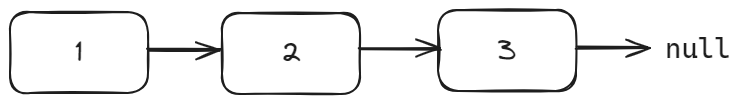

# yocto-queue —— 一个 tiny 使用链表实现的队列库


## 简单的介绍下链表

链表是一种常见的基础数据结构，是一种线性表，但是并不会按线性的顺序存储数据，而是在每一个节点里存到下一个节点的指针(Pointer)。

链表有一个数据域和一个指针域。

在 JavaScript 中，下面的 `Node` 的实例对象就可以用来表示一个链表节点:

```js
function Node(value) {
    this.value = value;
    this.next = null;
}
```

```js
const head = new Node(1);
head.next = new Node(2);
head.next.next = new Node(3);
```



## yocto-queue 库

[yocto-queue](https://github.com/sindresorhus/yocto-queue) 的介绍如下:

> You should use this package instead of an array if you do a lot of Array#push() and Array#shift() on large arrays, since Array#shift() has linear time complexity O(n) while Queue#dequeue() has constant time complexity O(1). That makes a huge difference for large arrays.

可以看到，不论是 `入对` 还是 `出队`，`yocto-queue` 的复杂度都是 `O(1)`，性能是非常好的。

### API

`queue = new Queue()`

- `.enqueue(value)`: 入队，时间复杂度: O(1)
- `.dequeue()`: 出队，时间复杂度: O(1)
- `.clear()`: 清空队列
- `.size`: 队列的大小

### 源码

下面就是 `yocto-queue` 的所有代码，只有 50 行左右，整体来看代码非常简洁，也没什么好解读的，加些注释即可。

```js
class Node {
	value;
	next;
	constructor(value) {
		this.value = value;
	}
}

/**
 * 链表实现的队列
 * 私有属性: #head, #tail, #size
 */
class Queue {
	// 指向队列的头部
	#head;
	// 指向队列的尾部
	#tail;
	#size;
	constructor() {
		this.clear();
	}
	enqueue(value) {
		const node = new Node(value);
		if (this.#head) {
			this.#tail.next = node;
			this.#tail = node;
		} else {
			this.#head = node;
			this.#tail = node;
		}
		this.#size++;
	}
	dequeue() {
		const current = this.#head;
		if (!current) {
			return;
		}
		this.#head = this.#head.next;
		this.#size--;
		return current.value;
	}
	clear() {
		this.#head = undefined;
		this.#tail = undefined;
		this.#size = 0;
	}
	get size() {
		return this.#size;
	}
	// 实现了迭代器属性，意味着实例对象是可迭代的
	// example: 
	// case 1: `...` spreading symbol
	// case 2: `for ... of`
	* [Symbol.iterator]() {
		let current = this.#head;
		while (current) {
			yield current.value;
			current = current.next;
		}
	}
}
```